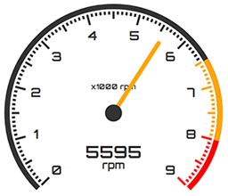

# angular-gauge



Gauge component for Angular

 v1.0.0

## Installation

```
npm install angular-gauge
```

## How to?

You should import the `GaugeModule` to your desired module:

```typescript
import { NgModule } from '@angular/core';
import { GaugeModule } from 'angular-gauge';

@NgModule({
    imports : [CommonModule, GaugeModule, ...],
})
export class SharedModule {}
```

Then you can simply import the component and add it to your template:

```typescript
import { Component } from '@angular/core';
import { GaugeComponent } from 'angular-gauge';

@Component({
  selector: 'app-my-component',
  template: `
    <ng-gauge
      [max]="9000"
      [input]="input"
    </ng-gauge>`
})
export class MyComponent {
  input: number;
}
```

## Options

The component provides a list of the following options:
- `max: number` (required) - The maximal value of the gauge. It is suggested to use a number that is divisible by 100, 1000 and so on.
- `input: number` (required) - The current value of the gauge.
- `unit: string` - The unit of the gauge (i.e. mph, psi, etc.)
- `start: number` (in degrees; default 225) - The start/beginning of the scale
- `end: number` (in degrees; default 135) - The end of the scale
- `showDigital: boolean` - Displays the current value as number inside the gauge
- `lightTheme: boolean` - Switches to the light theme
- `light: number` - Shows a red light when the specified limit is reached
- `sectors: Sectors[]` - Defines the coloring of specified sectors
- `factor: number` (Not recommended) - Changes the scale factor
- `config: GaugeConfig` (Not recommended) - Alters the default configuration; This may lead to unexpected behavior; [GaugeConfig](./src/app/gauge/shared/config.ts)

### Sectors

Sectors are used for marking parts of the arc with a different color.

Example:
```typescript
const max = 9000;
const sectors = [{
  from: 6500,
  to: 8000,
  color: 'orange'
}, {
  from: 8000,
  to: 9000,
  color: 'red'
}];
```

## Styling

The component provides two themes - light (default) and dark. Yet, you can easily alter the CSS through the parent component in order to fit your needs. The font used for the gauge is Orbitron (Google Fonts).
